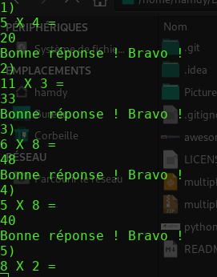

   

# Multiplications

## A quoi sert ce programme ?

C'est un petit programme qui permet de faire apprendre aux enfants les multiplications de 2 à 11.

Meilleure note : 6

Plus mauvaise note : 1

Nombre de questions : 20

## Télécharger la version .exe pour Windows :

## Developpeur - auteur 

Hamdy Abou El Anein
